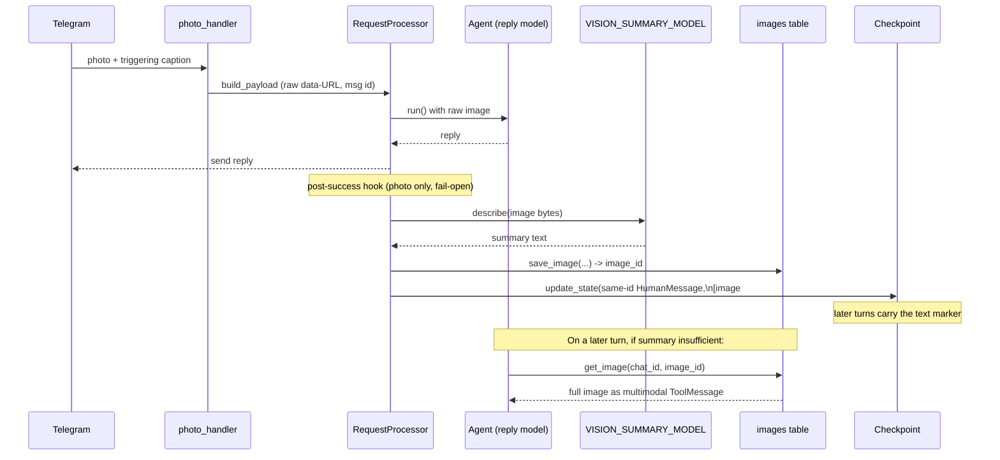

# Image Persistence and Agent-Side Retrieval

Design spec for [issue #23](https://github.com/6felix9/telegram-gpt/issues/23):
persist images durably, keep a lightweight text description in rolling context,
and let the agent pull the full image back on demand.

## Problem

Images are only available on the turn they arrive. `photo_handler()` sends the
raw image to the reply model once, but both the checkpoint and the `messages`
audit table store only a text marker (`[image] <caption>`). Later turns lose all
visual context — the model never sees the photo again unless the user re-sends
it. This was explicitly deferred as the "image-storage-window" feature in the
LangChain migration spec (`2026-07-04-langchain-agent-migration-design.md`,
Open Questions).

## Goals

- Persist image bytes durably, keyed by chat, surviving restarts and redeploys.
- Preserve *some* visual context across turns without carrying base64 payloads
  in the rolling checkpoint (which would blow the token budget).
- Let the reply model retrieve the full image on demand when the text
  description is not enough.
- Keep the triggering turn's behavior and latency unchanged.

## Non-Goals

- **Retention / cleanup of stored images.** Blobs accumulate unbounded, matching
  the current behavior of the `messages` table and historical checkpoint rows.
  Deferred to #21 / #22, which should design a coordinated policy across all
  three storage layers. (Noted as a known risk below.)
- **Non-triggering photos.** Still dropped entirely, exactly as today — no
  storage, no summary, no reply.
- **Multi-photo messages.** The existing single-photo assumption
  (`message.photo[-1]`) is unchanged.
- **Object storage / external services.** Bytes live in the existing Neon
  Postgres database.

## Storage: the `images` table

New Alembic migration `alembic/versions/0003_images.py`. Postgres `bytea` for
the bytes (consistent with keeping everything in Neon; no new service or
credentials).

| Column        | Type          | Notes                                            |
|---------------|---------------|--------------------------------------------------|
| `id`          | `bigserial` PK| The stable `image_id` used in markers and tools. |
| `chat_id`     | `text`        | Scopes retrieval; a chat sees only its own images.|
| `message_id`  | `bigint`      | Telegram message id, for correlation/debugging.  |
| `mime_type`   | `text`        | e.g. `image/jpeg`.                               |
| `caption`     | `text` null   | Original Telegram caption, if any.               |
| `summary`     | `text`        | Generated text description.                      |
| `image_bytes` | `bytea`       | Raw image bytes (not the base64 data-URL).       |
| `created_at`  | `timestamptz` | `default now()`.                                 |

Index on `(chat_id, id)` to support chat-scoped lookups.

New `database/image_repository.py` following the existing repository pattern
(`message_repository`, `summary_audit_repository`), exposed through the
`Database` facade in `database/__init__.py`:

- `save_image(chat_id, message_id, mime_type, caption, summary, image_bytes) -> int`
  — inserts one row, returns the new `id`.
- `get_image(chat_id, image_id) -> ImageRecord | None` — chat-scoped fetch;
  returns bytes + mime_type + summary + caption, or `None` when the id does not
  exist **or belongs to another chat**. This scoping is the isolation boundary:
  one chat can never read another chat's image even if it guesses an id.

## Ingest flow

The triggering turn is unchanged. `photo_handler()` → `RequestProcessor.process()`
still base64-encodes the photo into a data-URL content block and sends it
straight to the reply model at full fidelity, with no added latency and no
second model call before the reply.

Two changes support later persistence:

1. **Stable message id.** The photo's `HumanMessage` is constructed with an
   explicit `id` (a UUID) so the same message can be targeted for in-place
   rewrite after the reply. `prompt_builder.to_lc_human_message()` grows an
   optional `message_id` parameter; the photo path passes one, the text path
   does not (unchanged).

2. **Post-reply persistence step.** After `RequestProcessor` successfully sends
   the reply, a new step runs **only for photo requests**. Because text and
   photo currently share `RequestProcessor.process()`, this is passed in as an
   optional `post_success` hook (or an `on_persist` callback) so text requests
   are entirely unaffected. The step:

   1. Calls a small vision-capable model (`VISION_SUMMARY_MODEL`, see Config) to
      produce a short free-text description of the image. The image bytes are
      sent once here as a data-URL; the prompt asks for a compact description of
      objects, text, and notable details.
   2. Persists `image_bytes` + `mime_type` + `caption` + `summary` via
      `Database.save_image()`, receiving `image_id`.
   3. Rewrites the checkpoint via `graph.update_state()` with a new
      `HumanMessage` carrying **the same id** as the original photo message, but
      with its image content block replaced by a single text block:
      `[image #<image_id>] <summary>` (the caption, if any, is preserved in the
      text). LangGraph's `add_messages` reducer replaces a same-id message in
      place — this is the exact mechanism `agent.py` already uses to prune
      empty-reply messages (`RemoveMessage` / same-id update), so it is a proven
      pattern in this codebase, not a new one.

   The raw base64 payload therefore lives in active checkpoint state only for
   the single turn between the reply and this rewrite; from the next turn onward
   the rolling context carries the compact text marker instead.

### Fail-open

The entire persistence step is fail-open, mirroring the summarization
middleware's contract:

- If the vision-summary call fails, times out, or returns an empty/placeholder
  description → nothing is persisted, the checkpoint is left untouched, the raw
  image stays in state exactly as today (and is eventually sanitized to
  `[image omitted]` by the existing summarizer when it rolls into the older
  partition).
- If `save_image()` fails → same: no checkpoint rewrite, no marker.
- A failure here is **never** surfaced to the user. The reply has already been
  sent. Failures are logged (without image bytes or summary text, per the
  existing logging policy) and dropped.

The only observable effect of a failure is that *that* image won't be
retrievable later — a graceful degradation to today's behavior.

## Retrieval: the `get_image` tool

A single new tool, `get_image(image_id: int)`, added to the agent's tool set.
LangChain 1.0 supports tools that return multimodal content blocks (verified
against the LangChain OSS docs: a `@tool` may return a list of `{"type": "text"}`
/ `{"type": "image"}` blocks, converted into a multimodal `ToolMessage` when the
model supports it). The tool returns:

```python
[
    {"type": "text", "text": "Image #<id> (<caption>):"},
    {"type": "image", "base64": <b64>, "mime_type": <mime_type>},
]
```

so the full image re-enters context as the tool result, and the model can answer
follow-up questions the summary didn't cover.

**Chat scoping.** The tool reads `runtime.context.thread_id` from the existing
`AgentContext` (the same runtime-context mechanism `_make_dynamic_prompt`
already uses) and passes it to `db.get_image(chat_id, image_id)`. An id from
another chat, or a non-existent id, returns a plain text "image not found"
result — never another chat's bytes.

**Wiring.** `get_image` needs the `Database`, so `build_tools()` grows a `db`
parameter: `build_tools(config, db)`. It lives in a new `image_store.py` (tool
definition + the vision-summary helper), keeping `tools.py` focused on
web-search/fetch. `agent.py` already holds `self._db`, so the change at the call
site is `build_tools(self._config, self._db)`.

**System-prompt hint.** `prompt_builder.build_system_prompt()` gains one short
line telling the model that `[image #N] ...` markers refer to previously-shared
images and it may call `get_image(N)` to see the full picture when the
description is insufficient.

## Configuration

One new environment variable, following the `SUMMARY_MODEL` precedent (fixed,
independent of `/model` and of `SUMMARY_MODEL`):

| Var                   | Default        | Purpose                                        |
|-----------------------|----------------|------------------------------------------------|
| `VISION_SUMMARY_MODEL`| `gpt-4.1-mini` | Model used to describe images on ingest.       |

- Must be a vision-capable model present in `MODEL_PROVIDERS`. A
  `make_vision_summary_model(config)` helper mirrors `make_summary_model()`:
  resolve provider, validate the provider's API key is present, build via
  `init_chat_model`. Reuses the same validation/error-message shape.
- Added to `.env.example` and the CLAUDE.md Configuration list.
- **Config validation is lenient**, matching the migration spec's philosophy: a
  missing key for `VISION_SUMMARY_MODEL`'s provider must not block startup. If
  the vision model can't be built, image persistence simply fails open (images
  aren't summarized/stored), consistent with the fail-open ingest contract.

## Token accounting

`token_budget.py` already charges a flat cost for image content blocks rather
than counting base64 (`count_message_tokens`, the `image_url`/`image` branch).
The `[image #<id>] <summary>` text marker is counted as ordinary text, which is
strictly cheaper than the flat image charge — so replacing the raw block with
the marker only *reduces* measured context size. No change needed here. A
`get_image` tool result re-introduces one flat-charged image block for that turn
only; the trimming middleware handles it like any other recent message.

## Data flow summary



## Testing

Consistent with the repo's "pure logic, no DB / Telegram / live API" test
philosophy (`tests/`):

- **Marker construction** — the raw-image → `[image #<id>] <summary>` rewrite
  produces the expected content blocks and preserves the same message id.
- **`get_image` scoping** — with a fake/stub `db`, an id from another `chat_id`
  (or a missing id) returns the not-found text result, never bytes; a matching
  id returns the multimodal block list in the expected shape.
- **`build_tools(config, db)`** — `get_image` is present in the returned tool
  set; web-search/fetch tools are unaffected.
- **Vision model resolution** — `make_vision_summary_model()` validates
  `VISION_SUMMARY_MODEL` against `MODEL_PROVIDERS` and raises the same
  provider/key error shape as `make_summary_model()`; a missing provider key
  degrades to fail-open rather than crashing startup.
- **Fail-open ingest** — when the vision call or `save_image` raises, no
  checkpoint rewrite is attempted and no exception propagates to the caller.
- **`prompt_builder.to_lc_human_message(message_id=...)`** — photo path sets the
  id, text path is unchanged.

## Known risks / follow-ups

- **Unbounded image growth.** `bytea` blobs are far heavier per row than the
  text rows in `messages`. Storing unbounded (per this spec) is the single
  biggest storage-growth risk in the system. #21 / #22 should treat images as a
  first-class, high-priority target when they design coordinated retention, and
  the `images.created_at` column plus `(chat_id, id)` index exist specifically
  to make an age- or count-based policy cheap to add later.
- **Vision-summary quality vs. cost.** `gpt-4.1-mini` is a starting default;
  `VISION_SUMMARY_MODEL` can be tuned per environment without code changes.
- **Complements #20.** These image summaries are natural inputs to durable
  long-term memory if #20 lands.
